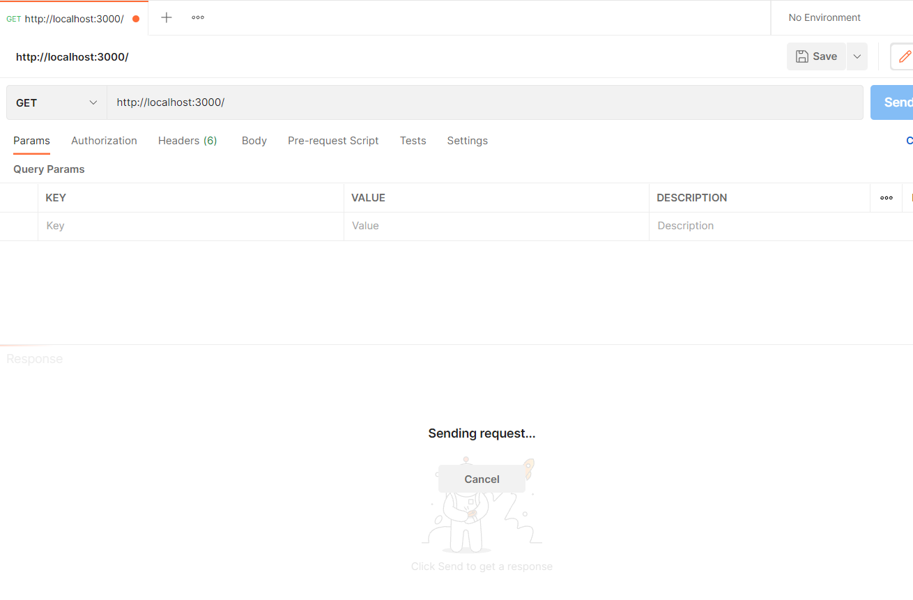
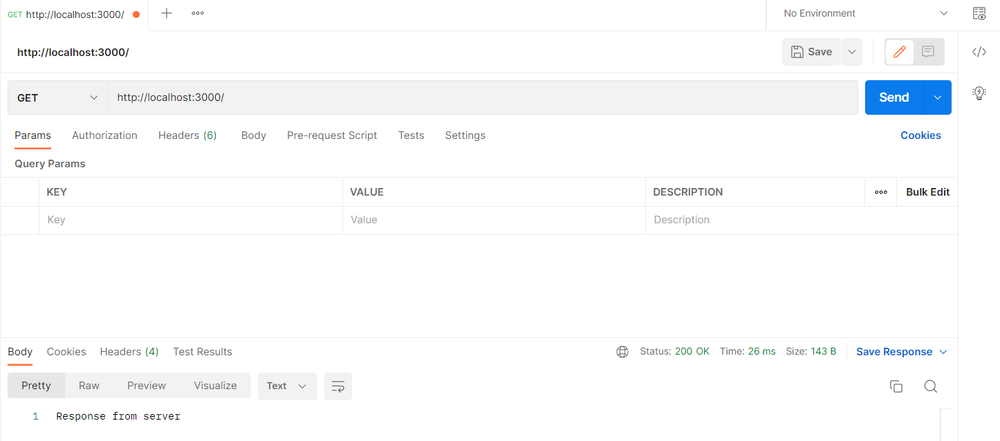
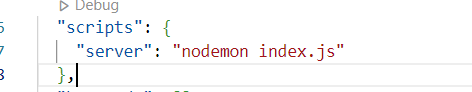
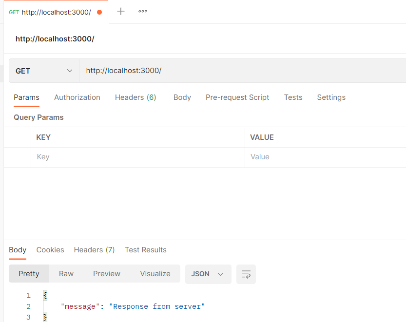

# How to create a Node Server without express

- First initialize the npm by giving the `npm init -y` command in the terminal.

- Create a file called `index.js` In this file require the HTTP module like below:

> const http=require('http');

- Call the `createServer()` method on it and assign it to the constant like below:

> const server=http.createServer();

Call the `listen()` method on the server constant like below:

> server.listen();

- pass the post to the listen method to listen on in this case passing conventional port number 3000.

> server.listen(3000);

# How to Test the Server

- To start the server give `node index.js` and hit Enter.Open `postman` or any `web browser` and give `http://localhost:3000/` in the address bar

- your server may endup loading infinitely like in below image
  yeah!! it's not `error` our server is up and running



# How to send back a response from the server.

- To communicate with the server we need to send the request and recieve the response for that we need to include the call back function to the `createServer()` method like below

> const server = http.createServer((request, response) => {response.end('Response from server');});

- `request` verb is to basically request something from the server and `response` verb is the response from the server `response.end()` method ends the communication with `server` with response.

- Below is the response from server



# How to create a Node server with express

- Previously we used to terminate and restart the server whenever we made changes in the `index.js` file to solve that we can use package called `nodemon` which automatically refresh the server whenever we make changes.

- `npm i nodemon`

- Also install the express package like so: `npm i express`

- Express is the NodeJs framework

- create a file named `app.js`

- inside that file require the `express` and assign it to the constant `app`

> const express=require('express);

> const app=express();

- Export the `app` constant to make it availabel in other file within directory.

> module.exports=app;

- Inside the `index.js` require the `app` that we exported from `app.js`

> const app=require('./app);

- Next, set the posrt using the app like below

> app.set('port',3000);

- And Replace the code inside `http.ceateServer()` with just `app`

> const server=http.createServer(app);

- The above code directs all API management to the `app.js` and helps in separating the concerns.

- Back in the `app.js` file let's create a endpoint to speak to server since we have directed all API management to it.

```javascript
app.use((request, response) => {
  response.json({ message: "Response from server" });
});
```

- To start the server first make the below change inside the `package.json` file



- And give the command like `npm run server` in the terminal

- Here's the output that i got in the postman


